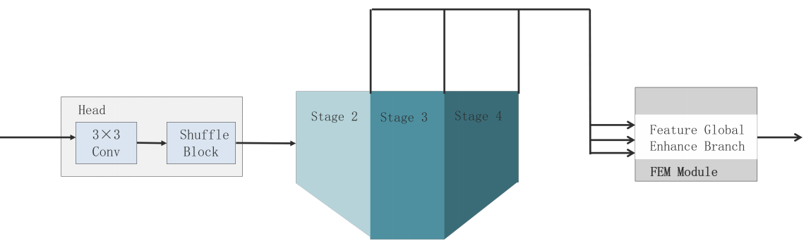
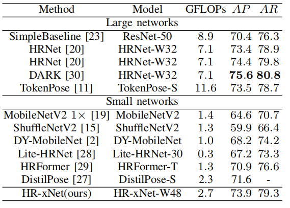
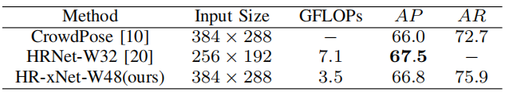

# HR-xNet: A Novel High-Resolution Network for Human Pose Estimation with Low Resource Consumption
## Introduction
This is an official pytorch implementation of HR-xNet: A Novel High-Resolution Network for Human Pose Estimation with Low Resource Consumption. In this work, we present a lightweight human pose estimation model, called HR-xNet. In the HR-xNet, we first replace the Stem and Stage 1 with the lightweight feature extraction head. Then, we propose the LMSD Conv, which is lighter compared with normal convolution. At last, we propose the feature enhancement module(FEM) to fuse the feature with different stage to enhance the performance of model.

## Network Structure




## Compartive result with other models
### Results on COCO val set


### Results on CrowdPose test set




## Environment

We use Pytorch == 1.7.5 on ubuntu18.04 and 3 NVIDIA GeForce 2080Ti to train our models.

## Dataset
### MPII
Download MPII dataset and follows the file structure:
```
LDNet_Code
         |--- data
                 |--- mpii
                         |--- annot
                         |--- images
```

### COCO
Download COCO dataset and follows the file structure:
```
LDNet_Code
         |--- data
                 |--- coco
                         |--- annotations
                         |--- person_detection_results
                         |--- images
                                   |--- train2017
                                   |--- val2017
```


## Qucik start
1、Install all packages
```
pip install -r requirements.txt
```
2、Training on COCO dataset
```
python tools/train.py
```
3、Testing on COCO dataset
```
python tools/test.py
```

